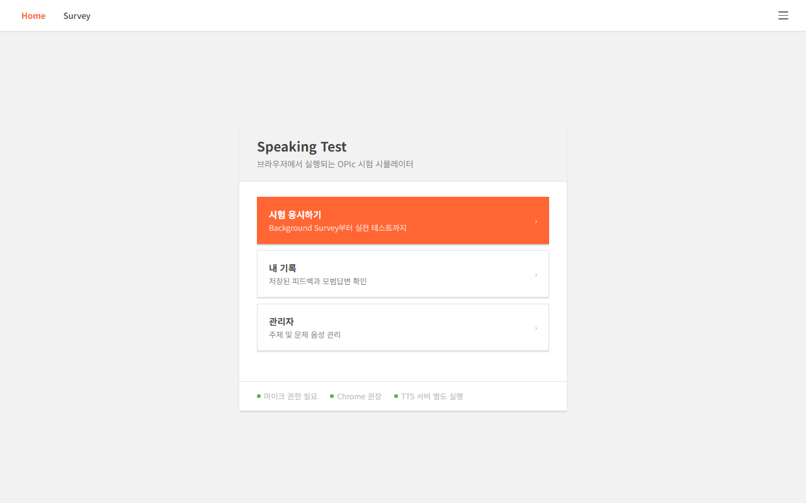
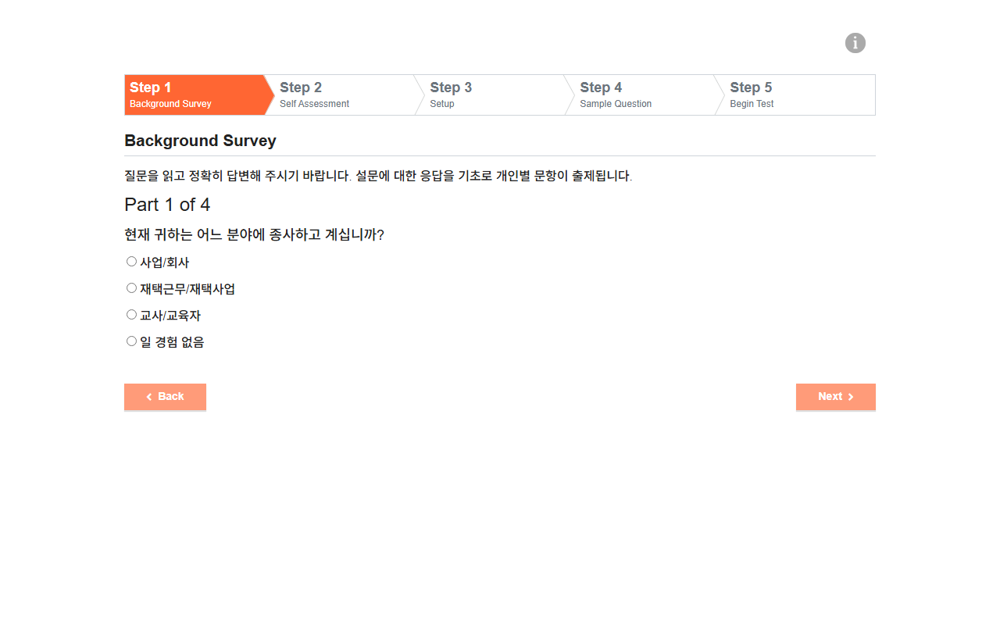
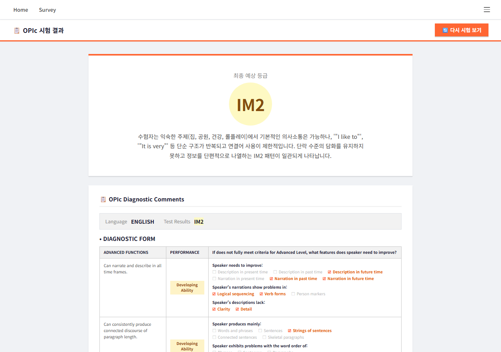
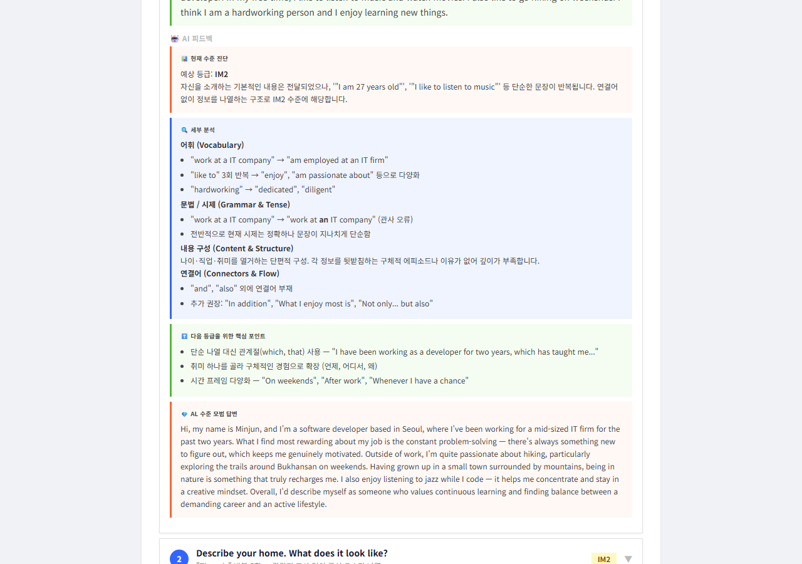
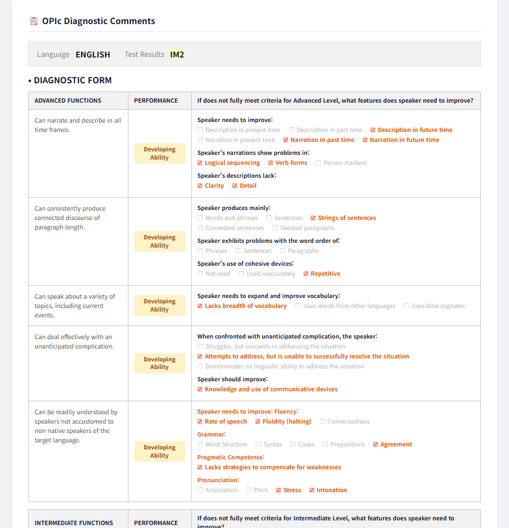

# OPIc 시뮬레이터

실제 OPIc 시험 환경을 로컬에서 재현하고, GPT-4o 기반 AI 채점 및 피드백을 제공하는 시뮬레이터입니다.

---

## 스크린샷

| 시작 화면 | Background Survey |
|:---------:|:-----------------:|
|  |  |

**시험 진행 화면 — Question 1 of 15**


| AI 채점 결과 (IM2) | 문항별 AI 피드백 |
|:-----------------:|:---------------:|
|  |  |

**OPIc Diagnostic Comments Form — Advanced / Intermediate Functions**



---

## 주요 기능

- **실전 시험 환경** — 실제 OPIc 화면과 동일한 UI로 시험 진행
- **Edge TTS 문제 음성 생성** — Microsoft Edge TTS로 영어 문제 음성 자동 생성
- **AI 채점 (GPT-4o)** — 시험 후 전체 답변을 분석해 NH~AH 등급 예측
- **문항별 상세 피드백** — 어휘·문법·구성·연결어 분석 + AL 수준 모범 답변 제공
- **관리자 페이지** — 주제별 TTS 문제 생성 및 음성 파일 관리

---

## 시작하기

### 요구사항

- Python 3.8+
- OpenAI API 키 (채점 기능 사용 시)

### 설치

```bash
pip install aiohttp edge-tts openai
```

### 환경 변수 설정

프로젝트 루트에 `.env` 파일을 생성하고 OpenAI API 키를 입력합니다.

```
OPENAI_API_KEY=sk-...
```

> `.env` 파일은 `.gitignore`에 포함되어 있어 git에 업로드되지 않습니다.

---

## 실행

터미널 두 개를 열고 각각 실행합니다.

**터미널 1 — 프론트엔드 서버**
```bash
python -m http.server 3000
```

**터미널 2 — TTS / AI 피드백 서버**
```bash
python tts_server.py
```

| 페이지 | URL |
|--------|-----|
| 시작 화면 | http://localhost:3000/public/start.html |
| 시험 화면 | http://localhost:3000/pages/opic-test.html |
| 관리자 | http://localhost:3000/public/admin.html |

> **주의:** 관리자 페이지는 반드시 `localhost:3000`으로 접속해야 시험 화면과 `localStorage`가 공유됩니다.

---

## 사용 흐름

```
1. admin.html   →  주제 선택 후 Edge TTS로 문제 음성 생성
2. opic-test.html  →  실전 시험 진행 (마이크 녹음 + 음성 인식)
3. result.html  →  GPT-4o 종합 채점 + 문항별 피드백 확인
```

---

## 프로젝트 구조

```
opic_simulator/
├── tts_server.py          # aiohttp 서버 (TTS + AI 피드백 API, port 8765)
├── questions_input.json   # 문제 텍스트 원본 입력 파일
├── generate_mp3.py        # MP3 일괄 생성 스크립트
├── generate_transcripts.py# 문제 텍스트 트랜스크립트 생성
├── trim_intro_numbers.py  # 음성 파일 전처리 유틸리티
│
├── public/
│   ├── start.html         # 시작 화면
│   ├── admin.html         # TTS 문제 관리 어드민
│   └── index.html
│
├── pages/
│   ├── opic-test.html     # 시험 진행 메인 화면
│   ├── result.html        # AI 채점 결과 화면
│   ├── setup.html         # 사전 설정 (마이크 테스트 등)
│   ├── survey-clone.html  # Background Survey
│   ├── self-assessment.html
│   └── begin-test.html
│
├── src/
│   ├── session-builder.js # 문제 세션 구성 로직
│   ├── main.js
│   └── data/
│       ├── questions.json # 주제별 문제 파일 경로 정의
│       └── transcripts.json # 문제 텍스트 매핑
│
├── assets/
│   ├── js/                # Vue.js, jQuery 등 라이브러리
│   └── css/
│
└── questions/
    ├── original/          # 원본 MP3 음성 파일 (git 제외)
    └── custom/            # Edge TTS로 생성한 MP3 파일 (git 제외)
```

---

## API 엔드포인트 (port 8765)

| Method | Endpoint | 설명 |
|--------|----------|------|
| GET | `/ping` | 서버 상태 확인 |
| POST | `/tts` | Edge TTS 음성 생성 |
| GET | `/scan-themes` | 생성된 테마/문항 목록 조회 |
| GET | `/topic-texts` | 주제별 문제 텍스트 조회 |
| POST | `/feedback` | 단일 문항 GPT-4o 피드백 |
| POST | `/overall-feedback` | 전체 시험 종합 채점 |
| POST | `/save-recordings` | 녹음 파일 저장 |
| GET | `/apikey-status` | API 키 설정 여부 확인 |
| POST | `/apikey-save` | API 키 저장 (`.env`) |

---

## OPIc 등급 기준

| 등급 | 설명 |
|------|------|
| NH | Novice High |
| IL / IM1 / IM2 / IM3 | Intermediate Low ~ Mid 3 |
| IH | Intermediate High |
| AL / AM / AH | Advanced Low ~ High |

---

## 주의사항

- MP3 음성 파일(`questions/original/`, `questions/custom/`)은 용량 문제로 git에서 제외됩니다. `python tts_server.py` 실행 후 관리자 페이지에서 직접 생성하세요.
- 녹음 파일(`recordings/`)도 git에서 제외됩니다.
- Chrome 브라우저 사용을 권장합니다 (Web Speech API 음성 인식).
